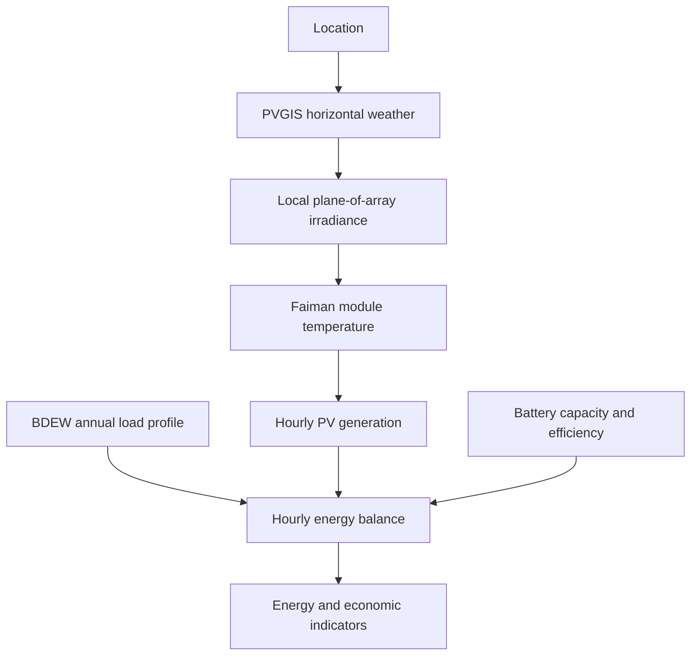

# PV Potential, Self-Consumption, and Battery Storage

A Streamlit application for comparing combinations of photovoltaic area and
battery capacity at a selected location. The application combines PVGIS 5.3
weather data, a local irradiance transposition model, the Faiman module
temperature model, and German BDEW standard load profiles.

The result is an hourly energy-balance simulation that reports PV generation,
direct consumption, battery use, grid feed-in, grid import, self-consumption,
self-sufficiency, and annual gross energy value for every configured system
combination.

> [!IMPORTANT]
> This project is an engineering and scenario-analysis tool. It is not a
> bankable yield assessment, an electrical design tool, or financial advice.

## Features

- Address-based geocoding or direct latitude/longitude input
- PVGIS 5.3 hourly weather data for 2014–2023
- Local conversion of horizontal irradiation to the selected module plane
- Faiman module-temperature model using air temperature and wind speed
- Local search for a high-yield tilt and azimuth without additional PVGIS calls
- BDEW 2025 load profiles for households, commercial users, and agriculture
- State-specific German public holidays
- Full matrix of PV areas and battery capacities
- Hourly battery dispatch with separate charging and discharging efficiencies
- Energy, autonomy, and gross-value indicators
- Charts for generation, usable energy, feed-in, grid import, and supply shares
- Semicolon-delimited CSV export
- Optional, separate 100-case comparison against direct PVGIS calculations

## Calculation workflow



For a normal application run, horizontal PVGIS weather data are requested once
for the selected location. All PV orientations, PV areas, and battery variants
are then calculated locally.

## Requirements

- Python 3.10 or newer is recommended
- Internet access for PVGIS and address geocoding
- The supplied BDEW CSV file in `data/`

Python packages are listed in `requirements.txt`.

## Installation

### Windows PowerShell

```powershell
py -m venv .venv
.\.venv\Scripts\Activate.ps1
python -m pip install --upgrade pip
python -m pip install -r requirements.txt
```

### macOS or Linux

```bash
python3 -m venv .venv
source .venv/bin/activate
python -m pip install --upgrade pip
python -m pip install -r requirements.txt
```

## Start the application

Run this command from the project directory:

```bash
python -m streamlit run app.py
```

Streamlit prints the local application URL in the terminal. It is usually
`http://localhost:8501`.

## Using the application

1. Select address entry or direct coordinates.
2. Enter the module tilt, azimuth, and efficiency.
3. Define minimum and maximum PV areas and the number of intervals.
4. Define minimum and maximum battery capacities and the number of intervals.
5. Select the BDEW profile, annual electricity consumption, and federal state.
6. Enter the electricity purchase price and feed-in tariff.
7. Review the advanced PV parameters if project-specific values are available.
8. Select **Calculate**.
9. Review the table and charts or download the complete result matrix as CSV.

The application evaluates `intervals + 1` values, including both endpoints.
For example, 5 intervals from 10 to 20 m² produce 6 PV-area values. The same
rule applies to the battery range.

### Orientation convention

Azimuth uses a compass convention:

| Azimuth | Direction |
| ---: | :--- |
| 0° or 360° | North |
| 90° | East |
| 180° | South |
| 270° | West |

## Input parameters

| Group | Parameter | Default | Meaning |
| :--- | :--- | ---: | :--- |
| Location | Address | Berlin, Germany | Geocoded location |
| Location | Coordinates | 52.5200, 13.4050 | Alternative manual location |
| PV | Tilt | 30° | Module inclination from horizontal |
| PV | Azimuth | 180° | Compass direction of the module surface |
| PV | Module efficiency | 20% | Efficiency at 25 °C |
| PV range | Area | 10–20 m² | Range evaluated by the matrix |
| Battery range | Capacity | 0–10 kWh | Nominal energy capacity |
| Battery | Efficiency | 95% | Applied separately to charging and discharging |
| Load | Annual consumption | 4,000 kWh/a | Target energy used to normalize the profile |
| Economics | Purchase price | 0.35 €/kWh | Value of avoided grid consumption |
| Economics | Feed-in tariff | 0.08 €/kWh | Revenue assigned to exported energy |
| Faiman | `U0` | 25.0 W/(m²·K) | Constant heat-loss coefficient |
| Faiman | `U1` | 6.84 W/(m²·K)/(m/s) | Wind-dependent heat-loss coefficient |
| Optical | Ground albedo | 0.20 | Ground reflectance |
| Optical | Reflection loss | 0% | Additional optical loss |
| System | Other losses | 0% | Additional downstream system loss |

Defaults are examples, not universal design values. Use parameters appropriate
for the module technology, mounting configuration, and project under study.

## BDEW load profiles

The user interface exposes these 2025 profiles:

| Code | Consumer type |
| :--- | :--- |
| `H25` | Household |
| `G25` | Commercial |
| `L25` | Agriculture |

The source CSV contains quarter-hour values. The application maps working days,
Saturdays, Sundays, and public holidays for the selected German federal state,
normalizes the profile to the entered annual consumption, and aggregates it to
hourly energy values. Municipal holidays are not detected automatically;
Assumption Day can be enabled separately for Bavaria.

## Model description

### Weather and irradiance

The application retrieves hourly beam and diffuse horizontal irradiance, air
temperature (`T2m`), and wind speed (`WS10m`) from the PVGIS 5.3 `seriescalc`
API for 2014–2023. Solar geometry and plane-of-array irradiance are calculated
locally. The ten weather years are combined into a representative average year.

### Module temperature

Module temperature is calculated with the Faiman model:

```text
T_module = T_air + G_POA / (U0 + U1 × wind_speed)
```

where `G_POA` is plane-of-array irradiance. The temperature-adjusted efficiency
is combined with optical and other system losses to obtain hourly electrical
energy.

The nominal PV capacity reported by the application is derived from area and
STC efficiency:

```text
PV capacity [kWp] = PV area [m²] × module efficiency [-]
```

This relation assumes the STC reference irradiance of 1 kW/m².

### Angle optimization

The optimizer maximizes annual electrical yield per square metre. It performs a
coarse global search followed by two local refinement stages. It does not
optimize self-consumption, battery operation, revenue, or lifecycle economics.

### Battery dispatch

For every simulated hour, the dispatch order is:

1. PV generation supplies simultaneous load.
2. Remaining PV surplus charges the battery.
3. The battery supplies any remaining load deficit.
4. Residual surplus is exported.
5. Residual deficit is imported from the grid.

The battery starts empty and can only be charged from PV. The entered efficiency
is applied once while charging and once while discharging. Consequently, 95%
per direction corresponds to a round-trip efficiency of approximately 90.25%.

The simplified battery model does **not** include:

- charging or discharging power limits;
- minimum state of charge or reserve;
- self-discharge and standby consumption;
- degradation, cycle aging, or calendar aging;
- inverter clipping or battery/inverter sizing;
- grid charging or tariff-based dispatch;
- battery investment, replacement, or operating costs.

### Economics

The annual gross value is calculated as:

```text
avoided purchase cost = self-consumed PV energy × purchase price
feed-in revenue       = exported PV energy × feed-in tariff
annual gross value    = avoided purchase cost + feed-in revenue
```

This is a gross energy value. It is not profit, cash flow, net present value, or
levelized cost of energy because investment and operating costs are excluded.

## Result columns

| Column | Unit | Description |
| :--- | :---: | :--- |
| `Area_m2` | m² | PV module area |
| `Battery_kWh` | kWh | Battery energy capacity |
| `PV_Capacity_kWp` | kWp | Area-derived nominal PV capacity |
| `Electricity_Generation_kWh_a` | kWh/a | Annual PV generation |
| `Direct_Use_kWh_a` | kWh/a | PV consumed directly by the load |
| `Battery_Use_kWh_a` | kWh/a | Battery energy delivered to the load |
| `Total_Usable_kWh_a` | kWh/a | Direct use plus battery-supplied energy |
| `Battery_Charge_from_PV_kWh_a` | kWh/a | PV energy entering the charging process |
| `Battery_Losses_kWh_a` | kWh/a | Charging and discharging losses |
| `Battery_SOC_Year_End_kWh` | kWh | Stored energy remaining at year end |
| `Feed_In_kWh_a` | kWh/a | PV energy exported to the grid |
| `Grid_Import_kWh_a` | kWh/a | Energy purchased from the grid |
| `Avoided_Purchase_Cost_EUR_a` | €/a | Value of self-consumed PV energy |
| `Feed_In_Revenue_EUR_a` | €/a | Revenue from exported PV energy |
| `Total_Value_EUR_a` | €/a | Sum of avoided cost and feed-in revenue |
| `Self_Consumption_Rate_pct` | % | Usable PV energy divided by PV generation |
| `Self_Sufficiency_Rate_pct` | % | Usable PV energy divided by annual load |

## Optional PVGIS 100-case validation

The normal application and the validation workflow are separate. Running
`app.py` does not perform 100 reference requests.

The validation benchmark evaluates 10 fixed German locations against 10 fixed
tilt/azimuth/peak-power configurations, producing exactly 100 cases. It
compares the local model with direct PVGIS 5.3 calculations for annual energy,
specific yield, and plane-of-array irradiation components.

Start the validation dashboard with:

```bash
python -m streamlit run pvgis_100case_validation_app.py
```

Or run the command-line workflow:

```bash
python run_pvgis_100case_validation.py --start-year 2014 --end-year 2023
```

Further methodological details are documented in
[`PVGIS_100CASE_VALIDATION.md`](PVGIS_100CASE_VALIDATION.md).

> [!NOTE]
> The benchmark uses PVGIS horizontal weather as input to the local model. It
> therefore isolates differences in transposition, temperature, and electrical
> modelling; it is not an independent validation of the underlying weather
> database.

## Testing

Install the application dependencies and the test runner, then run:

```bash
python -m pip install -r requirements.txt
python -m pip install pytest
python -m pytest -q
```

Some tests call PVGIS and therefore require internet access and API
availability. To run the local unit tests without the PVGIS integration tests:

```bash
python -m pytest -q \
  tests/test_angle_optimization.py \
  tests/test_area_battery_matrix.py \
  tests/test_area_range.py \
  tests/test_battery_model.py \
  tests/test_dst_handling.py \
  tests/test_economic_yield.py \
  tests/test_faiman_temperature.py \
  tests/test_public_interface.py \
  tests/test_validation_statistics_standalone.py
```

## Project structure

```text
.
├── app.py                              # Main Streamlit application
├── geocoding.py                        # Address and timezone lookup
├── load_profiles.py                    # BDEW calendar and load processing
├── data/
│   └── bdew_standard_load_profiles_2025.csv
├── pv_model/
│   ├── angle_optimization.py           # Local orientation search
│   ├── api_request.py                  # Horizontal PVGIS weather request
│   ├── battery_model.py                # Hourly battery dispatch
│   ├── economics.py                    # Annual gross energy value
│   ├── energy_production.py            # PV electricity calculation
│   ├── radiation.py                    # Irradiance transposition
│   ├── simulation.py                   # PV-area/battery matrix
│   ├── solar_geometry.py               # Solar position
│   ├── temperature_model.py            # Faiman model
│   ├── time_series.py                  # Time conversion and average year
│   ├── pvgis_validation.py             # PVGIS reference calculations
│   ├── pvgis_100case_validation.py     # Reproducible case matrix
│   ├── validation_plots.py             # Validation figures
│   └── validation_statistics.py        # Validation statistics
├── pvgis_100case_validation_app.py     # Validation dashboard
├── run_pvgis_100case_validation.py     # Validation CLI
├── scripts/
│   └── update_bdew_data.py             # BDEW data update helper
├── tests/                               # Automated tests
├── ARCHITECTURE.md
├── CHANGES.md
├── PVGIS_100CASE_VALIDATION.md
└── requirements.txt
```

## Troubleshooting

### PVGIS request fails

Check the internet connection, proxy, firewall, and PVGIS availability. A full
normal simulation uses one PVGIS weather request per uncached location; the
validation benchmark intentionally performs many more reference requests.

### Address cannot be resolved

Use a more specific address or switch to direct coordinates.

### Calculation takes a long time

Runtime grows with the number of PV areas and battery capacities. The number of
matrix variants is:

```text
(PV intervals + 1) × (battery intervals + 1)
```

Reduce one or both interval counts for a faster exploratory run.

### Results differ from commercial simulation software

Check weather years, transposition method, module coefficients, loss factors,
inverter assumptions, load resolution, battery power limits, initial state of
charge, and economic boundaries. Several of these effects are intentionally
simplified or omitted here.

## Data and external services

- Weather and reference calculations: European Commission Joint Research
  Centre, PVGIS 5.3
- Load profiles: BDEW standard load profiles supplied in the project data file
- Address lookup: OpenStreetMap Nominatim through `geopy`

Use of external services is subject to their availability and applicable usage
policies.

## License

No license file is included in this repository. Unless a license is added, the
code should not be assumed to grant rights for redistribution or reuse.
